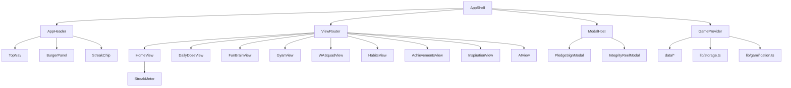

# Edubite — Investor Demo Frontend

Production-grade demo for **Edubite**: daily learning habits, gamification (RDM, levels, streaks), wellbeing habits, and AI integrity pledges. Built from the reference HTML design with a fresh-start experience (zero progress on first load).

## Quick start

```bash
cd Edubite
npm install
npm run dev
```

Open [http://localhost:3000](http://localhost:3000).

Production build:

```bash
npm run build
npm start
```

## Stack

- **Next.js 15** (App Router) + **React 19** + **TypeScript**
- **Tailwind CSS v4**
- **lucide-react** — icons
- **framer-motion** — view transitions, progress, modals
- **clsx** + **class-variance-authority** — component variants
- **Supabase Auth** — Google login and cookie session
- **SQLite (`node:sqlite`)** — signed-in local progress persistence (Node 22.5+)

## Product sections

| Section | Route hash | Description |
|---------|------------|-------------|
| Home | `#home` | Dashboard, function tiles, habits summary, streak meter |
| DailyDose | `#dailydose` | 5-question daily quiz (+45 RDM per correct) |
| FunBrain | `#funbrain` | 60-second sprint with combo scoring |
| Brain Gym | `#gyan` | Mini-games hub (memory, logic, speed, visual) + daily challenge, streaks, badges, local leaderboard |
| WA Squad | `#wasquad` | Jackpot + WhatsApp join CTA |
| Habits | `#habits` | 9 wellbeing checkboxes |
| Achievements | `#achievements` | Live progress badges |
| Inspiration | `#inspiration` | Quote, role model, did-you-know |
| AI | `#ai` | AM/PM pledges + integrity reel + research links |

## Where to edit mock content

All static content and thresholds live under [`data/`](data/):

| File | Contents |
|------|----------|
| [`data/config.ts`](data/config.ts) | RDM rewards, level ladder, feature labels (Gyan++ rename), nav, WA Squad |
| [`data/questions.ts`](data/questions.ts) | DailyDose + FunBrain question pools |
| [`data/habits.ts`](data/habits.ts) | Habit definitions |
| [`data/gyan.ts`](data/gyan.ts) | Legacy concept cards (unused by Brain Gym hub) |
| [`data/brain-gym/registry.ts`](data/brain-gym/registry.ts) | Brain Gym game metadata, categories, badges |
| [`data/achievements.ts`](data/achievements.ts) | Achievement definitions |
| [`data/inspiration.ts`](data/inspiration.ts) | Quotes, role model, did-you-know |
| [`data/pledges.ts`](data/pledges.ts) | Pledge copy, reel text, AI research links |

Gamification logic (streak rules, level calc, achievement checks): [`lib/gamification.ts`](lib/gamification.ts).

### Brain Gym

- **Hub UI:** [`components/brain-gym/hub/`](components/brain-gym/hub/)
- **Games:** [`components/brain-gym/games/`](components/brain-gym/games/)
- **Progress storage:** signed-in users save to local SQLite via [`app/api/progress/brain-gym`](app/api/progress/brain-gym/route.ts); scoped legacy `localStorage` keys migrate once.
- Playing games ticks `gyanTimeMs` toward the daily 30-min full-day criterion and awards RDM on session complete.

## State & persistence

- **Fresh start:** Level 1, 0 RDM, 0 streak, unsigned pledges, unchecked habits.
- **Signed-in persistence (production):** Supabase tables prefixed `edubite_*` (same Auth project as Edublast, isolated data):
  - `edubite_game_state` — Home, habits, pledges, streaks, RDM, dose/funbrain **scores**
  - `edubite_brain_gym_progress` + `edubite_reward_claims`
  - `edubite_puzzle_progress`
  - `edubite_inspiration_*` — Inspiration quotes / role model
  - `edubite_pledge_reel_*` — AM/PM reels
- **Not on Supabase content yet:** FunBrain static fallback remains in `data/questions.ts` only if DB is empty.
- **DailyDose on Supabase:** Class 11 & 12 PCM banks (900 MCQs each) live in `edubite_content_questions` with `class_level` — separate tracks, never merged. Import: `npm run import:pcm-daily-dose`.
- **FunBrain on Supabase:** 1080 MCQs (`domain = funbrain`, 6/day × 180 days). Import: `npm run import:funbrain`.
- **WA Squad:** UI only — join link is a placeholder.
- **Auth:** Supabase session cookies.
- **One-time migrate:** if Supabase row empty, legacy local SQLite progress is lifted once.

To inspect the local SQLite database shape:

```bash
npm run test:persistence
```

## Local SQLite notes

- Requires Node 22.5+ because the app uses `node:sqlite`.
- SQLite is local to one persistent machine/server. It is not shared across Vercel/serverless instances or multiple hosts.
- Dev mode ignores SQLite WAL files so database writes do not trigger Fast Refresh loops.

Current progress API surface:

```
GET / PUT  /api/progress/game       → GameState
GET / PUT  /api/progress/brain-gym  → BrainGymProgress + idempotent RDM reward claims
GET / PUT  /api/progress/puzzles    → PuzzleProgress
GET        /api/progress/health     → Supabase connectivity (public always; private if signed in)
GET        /api/content/today       → DailyDose + FunBrain for today (DB or static fallback)
```

## Admin content console

Restricted to allowlisted Google emails (`mailidpwd@gmail.com`, `alexis36sg@gmail.com`, or `EDUBITE_ADMIN_EMAILS`).

- UI: `/admin`
- **Supabase tables (Edubite-prefixed — not Edublast `play_questions`):**
  - `edubite_content_questions` — dated DailyDose / FunBrain MCQs
  - `edubite_pledge_reel_days` / `edubite_pledge_reel_slides` — AM + PM reels (`pledge_slot`)
  - Helper: `edubite_is_content_admin()` (email allowlist; independent of Web `user_roles`)
- APIs: `/api/admin/me`, `/api/admin/questions`, `/api/admin/schedule`, `/api/content/today`, `/api/content/pledge-reel?slot=am|pm`
- Dual-read: published Supabase rows for today → else static `data/questions.ts` / `data/pledge-reels-am.ts` / `data/pledge-reels-pm.ts`

```bash
npm run seed:pledges:am   # morning learning pledge (180 days)
npm run seed:pledges:pm   # night integrity pledge (180 days)
```


## Architecture / dependency map



### Folder map

```
app/           → layout, page, global styles
components/    → layout shell, UI primitives, section views, modals
data/          → editable mock catalogs + config
lib/           → types, utils, gamification, storage, store
```

## Design notes

Visual tokens match the reference HTML: `#0B0D12` background, teal/amber/purple accents, Baloo 2 display + Inter body + JetBrains Mono for stats.

The app shows a skeleton until `localStorage` hydrates to avoid SSR flash of wrong values.

---

Built for investor demos. Plug in backend when ready — the UI layer is intentionally decoupled from persistence.
